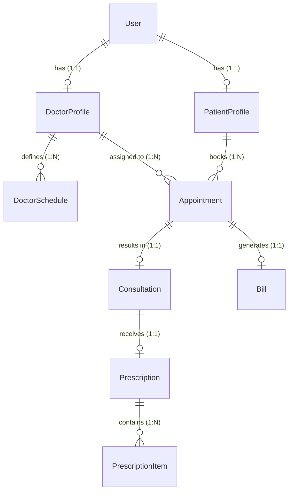

# MediFlow Clinic Management System

> A web-based Clinic Appointment & Prescription Management System that allows patients to discover active doctors, view doctor schedules, book appointments online for physical clinic visits, receive consultations during clinic visits, access digital prescriptions, and maintain centralized medical history records while enabling doctors and administrators to manage the complete clinic workflow efficiently.

---

## 🎯 Project Scope

MediFlow is focused on streamlining the workflow of a **single clinic**. The application intentionally delivers a clean, maintainable Minimum Viable Product (MVP) for core clinic operations rather than attempting to cover every module of a massive hospital management system.

### Included
- Single clinic administration
- Physical clinic appointment scheduling
- Doctor schedule management
- Patient consultations & private notes
- Structured digital prescriptions
- Centralized medical history tracking
- Manual consultation billing (paid/unpaid tracking)
- Strict role-based access control (Admin, Doctor, Patient)

### Out of Scope
- Multi-clinic or multi-branch support
- Telemedicine, video calls, or live chat
- Online payment gateways (Stripe, PayPal)
- Pharmacy inventory & stock management
- Laboratory management & diagnostic reports
- AI-assisted medical diagnosis
- Insurance claim processing
- Multi-tenant SaaS architecture

---

## 🏗 Architecture Overview

MediFlow employs a modern monolithic architecture utilizing the **Inertia.js** protocol to bridge the gap between a server-rendered Laravel backend and a client-side React frontend.


---

## ✨ Implemented Features

The system is strictly compartmentalized using Laravel Middleware and Fortify to serve three primary user roles: **Admin**, **Doctor**, and **Patient**.

### 🔒 Core System & Security
- **Authentication**: Secure login, registration, and email verification powered by Laravel Fortify.
- **Authorization**: Role-based access control (RBAC) ensuring strict boundaries between patients, doctors, and clinic administrators.
- **Asynchronous Processing**: Background job processing via database queues (used for dispatching emails and heavy operations).
- **Debugging**: Integrated **Laravel Telescope** for deep local debugging of queries, jobs, and requests.

### 👑 Admin Workspace
- **Clinic Overview**: High-level dashboard tracking clinic metrics.
- **User Management**: View user tables, inspect roles, and seamlessly toggle user account active status.
- **Doctor Management**: Onboard new doctors, assign specialties, define consultation fees, and toggle active working status.
- **Clinical Oversight**: Full read-access to clinic-wide Appointments, Consultations, Prescriptions, and Bills.
- **Financial & Operational Reports**: Generate and view systematic clinic reports.

### 🩺 Doctor Workspace
- **Schedule Management**: Define recurring weekly availability slots (Day, Start/End Time, Slot Duration).
- **Appointment Queue**: Real-time view of pending requests, with the ability to **Approve**, **Reject**, **Cancel**, or mark patients as **No-Show**.
- **Consultation Workflow**: Conduct consultations, record symptoms, create diagnoses, and log private medical notes.
- **Prescription Issuance**: Issue structured prescriptions containing multiple medication items (dosage, frequency, duration).
- **Patient History**: Access the complete, historical medical records of assigned patients.
- **Billing Management**: Track generated consultation bills and mark patient bills as Paid.

### 🧑‍⚕️ Patient Workspace
- **Doctor Discovery**: Browse the clinic's directory of active doctors by specialization and consultation fee.
- **Live Scheduling**: View dynamically generated, real-time available time slots based on doctor schedules and existing appointments.
- **Appointment Lifecycle**: Book new appointments and cancel pending ones.
- **Medical Records**: Access personal historical data, including past consultations, recorded diagnoses, and issued prescriptions.
- **Billing Transparency**: View pending and paid consultation bills.

---

## 💾 Domain Model (Database Schema)

The core domain relies on highly normalized relationships managed by Eloquent ORM.



---

## 🛠 Technology Stack

### Backend
- **Framework**: Laravel `v13.17`
- **Language**: PHP `^8.4`
- **Database**: SQLite (Default) or MySQL
- **Authentication**: Laravel Fortify `^1.37`
- **Developer Tools**: Laravel Telescope, Pint, Larastan, PestPHP

### Frontend
- **Library**: React `^19.2`
- **Language**: TypeScript `^5.7`
- **Bridge**: Inertia.js `^3.0`
- **Styling**: Tailwind CSS `^4.0`
- **UI Architecture**: shadcn/ui
- **Animation & Effects**: Framer Motion, Aceternity UI, Magic UI
- **Icons & Primitives**: Lucide React, Radix UI
- **Bundler**: Vite `^8.0`

### Recommended Local Tools
- **Laravel Herd**: For an effortless, zero-configuration local PHP development environment.
- **DBngin** & **DBeaver**: For database service management and inspection.

---

## 📂 Project Directory Structure

The repository follows a standard Laravel + React monolithic structure, emphasizing a strict separation of concerns between backend business logic and frontend presentation.

```text
MediFlow/
├── app/                        # Backend Engine (Laravel)
│   ├── Http/
│   │   └── Controllers/        # API Request Handlers (Admin, Doctor, Patient)
│   ├── Models/                 # Eloquent Database Models (User, Appointment, etc.)
│   └── Providers/              # Service Providers
├── config/                     # Centralized configuration (Database, Mail, Fortify)
├── database/                   # Data Layer
│   ├── migrations/             # Database Schema Definitions
│   └── seeders/                # Test Data Generation
├── public/                     # Publicly accessible assets & entry point
├── resources/                  
│   └── js/                     # Frontend Workspace (React + TypeScript)
│       ├── components/         # Reusable UI (Radix, Tailwind, shadcn/ui)
│       ├── layouts/            # Shared Page Layouts
│       └── pages/              # Inertia Page Components
│           ├── admin/          # Admin Views
│           ├── doctor/         # Doctor Views
│           └── patient/        # Patient Views
├── routes/                     # HTTP Routing
│   └── web.php                 # Web & Inertia Routes
├── .env.example                # Environment Configuration Template
├── composer.json               # PHP Dependencies
├── package.json                # Node/NPM Dependencies
└── vite.config.ts              # Vite Bundler Configuration
```

---

## 🚀 Local Development Setup

Follow these steps to quickly scaffold the application in a local environment. 

> [!NOTE]
> **Recommended Environment**: We highly recommend using [Laravel Herd](https://herd.laravel.com/) for an effortless, zero-config PHP environment, alongside **DBngin** or **DBeaver** for database inspection.

### 1. Prerequisites
Ensure your local machine has:
- **PHP** `^8.4`
- **Composer** (Latest)
- **Node.js** `^22.0+`
- **Git**

### 2. Installation
```bash
# Clone the repository
git clone <repository-url>
cd MediFlow

# Install backend & frontend dependencies
composer install
npm install

# Setup environment configuration
cp .env.example .env
php artisan key:generate
```

### 3. Database Initialization
By default, the application uses **SQLite**, meaning no database server configuration is required out of the box.
```bash
# Run migrations and seed initial test data (Admin, Doctors, Patients)
php artisan migrate --seed
```
*(If prompted to create the `database.sqlite` file, type `yes`).*

### 4. Running the Application
We utilize a custom Composer script to concurrently start the PHP server, the Vite HMR server, and the database queue listener.

```bash
# Starts all necessary development servers simultaneously
composer run dev
```
*(If using Laravel Herd, the site is served automatically. You only need to run `npm run dev` and `php artisan queue:listen`.)*

---

## ⚙️ Environment Configuration

The `.env` file requires the following key variables for proper operation:

| Variable | Description |
|----------|-------------|
| `APP_NAME` | Name of the app (e.g., `MediFlow`). Used in UI and email templates. |
| `APP_ENV` | `local` for development, `production` for live deployments. |
| `DB_CONNECTION` | Database driver. Defaults to `sqlite`. |
| `QUEUE_CONNECTION` | Must be set to `database` to process background jobs. |
| `MAIL_MAILER` | Mail driver. Configured for `brevo`. |
| `BREVO_API_KEY` | Your Brevo API key for transactional emails. |
| `MAIL_FROM_ADDRESS` | Address used for system-generated outbound emails. |

---

## 🧑‍💻 Command Reference

A quick reference for commonly used commands in this repository.

| Category | Command | Description |
|----------|---------|-------------|
| **Servers** | `composer run dev` | Runs PHP server, Vite, and Queue concurrently. |
| **Servers** | `npm run build` | Compiles and minifies frontend assets for production. |
| **Database**| `php artisan migrate:fresh --seed` | Wipes the database, re-runs all migrations, and seeds test data. |
| **Testing** | `php artisan test` | Executes the PestPHP / PHPUnit test suite. |
| **Linting** | `composer run lint` | Formats backend PHP code using Laravel Pint. |
| **Linting** | `npm run lint` | Formats and lints frontend React/TS code via ESLint. |
| **Routing** | `php artisan route:list` | Displays all registered application routes. |

---

## 🔧 Troubleshooting

| Issue | Common Cause & Solution |
|-------|-------------------------|
| **500 Server Error** | Missing `APP_KEY`. Run `php artisan key:generate`. |
| **Vite Manifest Not Found** | Frontend assets are missing. Run `npm run dev` or `npm run build`. |
| **Emails Not Sending** | Queue worker is not running. Ensure you are running `php artisan queue:listen`. |
| **Database Connection Refused** | Ensure `database/database.sqlite` exists and is writable, or verify your MySQL `.env` credentials. |
| **Type/ESLint Errors** | Outdated Node modules. Run `rm -rf node_modules package-lock.json && npm install`. |

---

## 📄 License

This project is licensed under the [MIT License](LICENSE).
