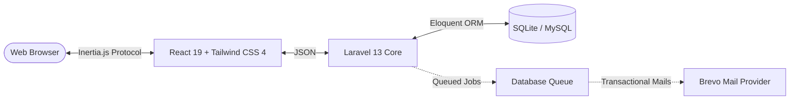
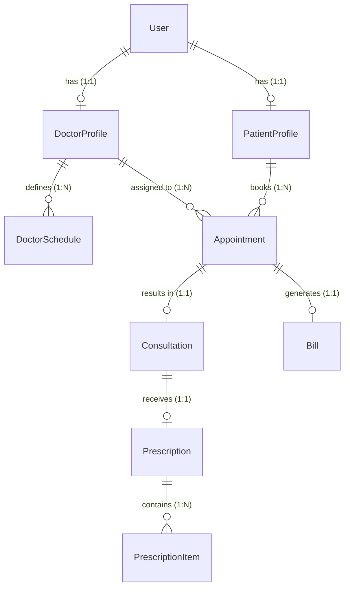

# MediFlow Clinic Management System

**🟢 Live Production Demo:** [https://mediflow-app.me/](https://mediflow-app.me/)

> A web-based Clinic Appointment & Prescription Management System that allows patients to discover active doctors, view doctor schedules, book appointments online for physical clinic visits, receive consultations during clinic visits, access digital prescriptions, and maintain centralized medical history records while enabling doctors and administrators to manage the complete clinic workflow efficiently.

---

## 🎯 Project Scope

MediFlow is focused on streamlining the workflow of a **single clinic**. The application intentionally delivers a clean, maintainable Minimum Viable Product (MVP) for core clinic operations rather than attempting to cover every module of a massive hospital management system.

### Included
- Single clinic administration
- Physical clinic appointment scheduling
- Doctor schedule management
- Patient consultations & private notes
- Structured digital prescriptions
- Centralized medical history tracking
- Manual consultation billing (paid/unpaid tracking)
- Strict role-based access control (Admin, Doctor, Patient)

### Out of Scope
- Multi-clinic or multi-branch support
- Telemedicine, video calls, or live chat
- Online payment gateways (Stripe, PayPal)
- Pharmacy inventory & stock management
- Laboratory management & diagnostic reports
- AI-assisted medical diagnosis
- Insurance claim processing
- Multi-tenant SaaS architecture

---

## 🏗 Architecture Overview

MediFlow employs a modern monolithic architecture utilizing the **Inertia.js** protocol to bridge the gap between a server-rendered Laravel backend and a client-side React frontend.



---

## ✨ Implemented Features

The system operates on a strictly compartmentalized architecture governed by Laravel Middleware and Fortify, serving three distinct operational roles. Every feature listed below is 100% functional and verified in the current codebase.

### 🔒 Core Infrastructure
| Category | Technical Implementation |
|----------|--------------------------|
| **🔐 Authentication** | Secure session-based auth, user registration, and email verification (powered by `Laravel Fortify`). |
| **🛡️ Authorization** | Strict Role-Based Access Control (RBAC) preventing cross-role access (Admin, Doctor, Patient). |
| **⚡ Async Processing**| Database-driven job queues for non-blocking operations like dispatching transactional emails. |
| **🐛 Developer Tooling**| Built-in `Laravel Telescope` integration for deep query, request, and background job debugging. |

### 👑 Administrator Capabilities
| Feature | Operational Scope |
|---------|-------------------|
| **📊 Clinic Dashboard** | High-level metrics tracking active users, total doctors, and daily appointments. |
| **👥 User Management** | View comprehensive user tables and instantly toggle account access (`active`/`suspended`). |
| **🩺 Doctor Onboarding**| Register new doctors, assign exact medical specialties, set consultation fees, and toggle employment status. |
| **👁️ Clinical Oversight**| Unrestricted read-access to clinic-wide data (Appointments, Consultations, Prescriptions, and Bills). |
| **📈 Reporting** | Generate and review systematic clinic performance and financial reports. |

### 🩺 Doctor Workspace
| Feature | Operational Scope |
|---------|-------------------|
| **📅 Schedule Control** | Dynamically define weekly availability (Day of week, Start/End time, and precise slot duration in minutes). |
| **📥 Appointment Queue**| Real-time processing of pending patient requests. Doctors can `Approve`, `Reject`, `Cancel`, or flag as `No-Show`. |
| **⚕️ Clinical Consultations**| Dedicated workflow to record patient symptoms, formal diagnosis, and private doctor-only notes. |
| **💊 Digital Prescriptions**| Issue structured medical prescriptions supporting multiple line items (Medicine Name, Dosage, Frequency, Duration). |
| **📂 Patient History** | Instant access to the historical timeline of an assigned patient's past appointments and prescriptions. |
| **💳 Billing Oversight** | View auto-generated consultation bills and manually mark them as `Paid` upon collection. |

### 🧑‍⚕️ Patient Portal
| Feature | Operational Scope |
|---------|-------------------|
| **🔍 Doctor Discovery** | Browse the active clinic directory filtered by doctor specialization and upfront consultation fees. |
| **⏱️ Live Booking** | View real-time, conflict-free time slots derived from the doctor's predefined schedule and current bookings. |
| **📆 Appointment Lifecycle**| Submit new booking requests and cancel existing pending appointments directly from the dashboard. |
| **🏥 Medical Records** | Access a permanent personal archive of past consultations, doctor diagnoses, and digital prescriptions. |
| **🧾 Financial Ledger** | Transparent view of all pending and cleared consultation bills. |

---

## 💾 Domain Model (Database Schema)

The core domain relies on highly normalized relationships managed by Eloquent ORM.



### 🗄 Data Dictionary

Below is the strict structural definition of the core entities, including data types, constraints, and allowed domains (enums).

#### `users`
| Attribute | Type | Key/Constraint | Domain / Notes |
|---|---|---|---|
| `id` | bigint | PK | Auto-incrementing |
| `name` | string | | |
| `email` | string | Unique | |
| `password` | string | | Hashed |
| `role` | enum | | `admin`, `doctor`, `patient` |
| `status` | enum | Default: `active` | `active`, `suspended` |

#### `patient_profiles`
| Attribute | Type | Key/Constraint | Domain / Notes |
|---|---|---|---|
| `id` | bigint | PK | Auto-incrementing |
| `user_id` | bigint | FK (`users.id`) | Unique (1:1), Cascade Delete |
| `phone` | string | | |
| `gender` | enum | | `male`, `female`, `other` |
| `dob` | date | Nullable | |
| `address` | text | Nullable | |
| `allergies` | text | Nullable | |
| `major_diseases` | text | Nullable | |

#### `doctor_profiles`
| Attribute | Type | Key/Constraint | Domain / Notes |
|---|---|---|---|
| `id` | bigint | PK | Auto-incrementing |
| `user_id` | bigint | FK (`users.id`) | Unique (1:1), Cascade Delete |
| `specialization` | string | | |
| `qualification` | string | | |
| `experience` | integer | | Years of experience |
| `consultation_fee` | decimal(8,2)| | |

#### `doctor_schedules`
| Attribute | Type | Key/Constraint | Domain / Notes |
|---|---|---|---|
| `id` | bigint | PK | Auto-incrementing |
| `doctor_id` | bigint | FK (`doctor_profiles.id`) | Cascade Delete |
| `day` | enum | | `Monday`, `Tuesday`, `Wednesday`, `Thursday`, `Friday`, `Saturday`, `Sunday` |
| `start_time` | time | | |
| `end_time` | time | | |
| `duration` | integer | | Slot duration in minutes |

#### `appointments`
| Attribute | Type | Key/Constraint | Domain / Notes |
|---|---|---|---|
| `id` | bigint | PK | Auto-incrementing |
| `patient_id` | bigint | FK (`patient_profiles.id`) | Cascade Delete |
| `doctor_id` | bigint | FK (`doctor_profiles.id`) | Cascade Delete |
| `appointment_date` | date | | |
| `appointment_time` | time | | |
| `reason` | text | Nullable | |
| `status` | enum | Default: `pending` | `pending`, `confirmed`, `rejected`, `cancelled`, `no_show`, `completed` |
| `cancelled_by` | enum | Nullable | `patient`, `doctor` |
| `cancel_reason` | text | Nullable | |
| `reject_reason` | text | Nullable | |

#### `consultations`
| Attribute | Type | Key/Constraint | Domain / Notes |
|---|---|---|---|
| `id` | bigint | PK | Auto-incrementing |
| `appointment_id` | bigint | FK (`appointments.id`) | Unique (1:1), Cascade Delete |
| `symptoms` | text | | |
| `diagnosis` | text | | |
| `notes` | text | Nullable | Private doctor notes |

#### `prescriptions`
| Attribute | Type | Key/Constraint | Domain / Notes |
|---|---|---|---|
| `id` | bigint | PK | Auto-incrementing |
| `consultation_id`| bigint | FK (`consultations.id`) | Unique (1:1), Cascade Delete |
| `instructions` | text | Nullable | General usage instructions |

#### `prescription_items`
| Attribute | Type | Key/Constraint | Domain / Notes |
|---|---|---|---|
| `id` | bigint | PK | Auto-incrementing |
| `prescription_id`| bigint | FK (`prescriptions.id`) | Cascade Delete |
| `medicine_name` | string | | |
| `dosage` | string | | e.g., "500mg" |
| `frequency` | string | | e.g., "1-0-1" or "Twice daily" |
| `duration` | string | | e.g., "5 Days" |

#### `bills`
| Attribute | Type | Key/Constraint | Domain / Notes |
|---|---|---|---|
| `id` | bigint | PK | Auto-incrementing |
| `appointment_id` | bigint | FK (`appointments.id`) | Unique (1:1), Cascade Delete |
| `amount` | decimal(8,2)| | Auto-populated from doctor profile |
| `status` | enum | Default: `unpaid` | `unpaid`, `paid` |

---

## 🛠 Technology Stack

### Backend
- **Framework**: Laravel `v13.17`
- **Language**: PHP `^8.4`
- **Database**: SQLite (Default) or MySQL
- **Authentication**: Laravel Fortify `^1.37`
- **Developer Tools**: Laravel Telescope, Pint, Larastan, PestPHP

### Frontend
- **Library**: React `^19.2`
- **Language**: TypeScript `^5.7`
- **Bridge**: Inertia.js `^3.0`
- **Styling**: Tailwind CSS `^4.0`
- **UI Architecture**: shadcn/ui
- **Animation & Effects**: Framer Motion, Aceternity UI, Magic UI
- **Icons & Primitives**: Lucide React, Radix UI
- **Bundler**: Vite `^8.0`

### Recommended Local Tools
- **Laravel Herd**: If you want to avoid manually setting up PHP, Node.js, and Composer, Herd provides an effortless, zero-configuration environment with everything bundled out-of-the-box.
- **DBngin** & **DBeaver**: For database service management and inspection.

---

## 📂 Project Directory Structure

The repository follows a standard Laravel + React monolithic structure, emphasizing a strict separation of concerns between backend business logic and frontend presentation.

```text
MediFlow/
├── app/                        # Backend Engine (Laravel)
│   ├── Http/
│   │   └── Controllers/        # API Request Handlers (Admin, Doctor, Patient)
│   ├── Models/                 # Eloquent Database Models (User, Appointment, etc.)
│   └── Providers/              # Service Providers
├── config/                     # Centralized configuration (Database, Mail, Fortify)
├── database/                   # Data Layer
│   ├── migrations/             # Database Schema Definitions
│   └── seeders/                # Test Data Generation
├── public/                     # Publicly accessible assets & entry point
├── resources/                  
│   └── js/                     # Frontend Workspace (React + TypeScript)
│       ├── components/         # Reusable UI (Radix, Tailwind, shadcn/ui)
│       ├── layouts/            # Shared Page Layouts
│       └── pages/              # Inertia Page Components
│           ├── admin/          # Admin Views
│           ├── doctor/         # Doctor Views
│           └── patient/        # Patient Views
├── routes/                     # HTTP Routing
│   └── web.php                 # Web & Inertia Routes
├── .env.example                # Environment Configuration Template
├── composer.json               # PHP Dependencies
├── package.json                # Node/NPM Dependencies
└── vite.config.ts              # Vite Bundler Configuration
```

---

## 🚀 Local Development Setup

Follow these steps to quickly scaffold the application in a local environment. 

> [!NOTE]
> **Recommended Environment**: If you want to avoid the hassle of manually installing PHP, Node.js, and Composer, we highly recommend using [Laravel Herd](https://herd.laravel.com/). It provides a complete, zero-configuration development environment. We also recommend **DBngin** or **DBeaver** for database management.

### 1. Prerequisites
Ensure your local machine has:
- **PHP** `^8.4`
- **Composer** (Latest)
- **Node.js** `^22.0+`
- **Git**

### 2. Installation
```bash
# Clone the repository
git clone <repository-url>
cd MediFlow

# Install backend & frontend dependencies
composer install
npm install

# Setup environment configuration
cp .env.example .env
php artisan key:generate
```

### 3. Database Initialization
By default, the application uses **SQLite**, meaning no database server configuration is required out of the box.
```bash
# Run migrations and seed initial test data (Admin, Doctors, Patients)
php artisan migrate --seed
```
*(If prompted to create the `database.sqlite` file, type `yes`).*

### 4. Running the Application
We utilize a custom Composer script to concurrently start the PHP server, the Vite HMR server, and the database queue listener.

```bash
# Starts all necessary development servers simultaneously
composer run dev
```
*(If using Laravel Herd, the site is served automatically. You only need to run `npm run dev` and `php artisan queue:listen`.)*

---

## ⚙️ Environment Configuration

The `.env` file requires the following key variables for proper operation:

| Variable | Description |
|----------|-------------|
| `APP_NAME` | Name of the app (e.g., `MediFlow`). Used in UI and email templates. |
| `APP_ENV` | `local` for development, `production` for live deployments. |
| `DB_CONNECTION` | Database driver. Defaults to `sqlite`. |
| `QUEUE_CONNECTION` | Must be set to `database` to process background jobs. |
| `MAIL_MAILER` | Mail driver. Configured for `brevo`. |
| `BREVO_API_KEY` | Your Brevo API key for transactional emails. |
| `MAIL_FROM_ADDRESS` | Address used for system-generated outbound emails. |

---

## 🧑‍💻 Command Reference

A quick reference for commonly used commands in this repository.

| Category | Command | Description |
|----------|---------|-------------|
| **Servers** | `composer run dev` | Runs PHP server, Vite, and Queue concurrently. |
| **Servers** | `npm run build` | Compiles and minifies frontend assets for production. |
| **Database**| `php artisan migrate:fresh --seed` | Wipes the database, re-runs all migrations, and seeds test data. |
| **Testing** | `php artisan test` | Executes the PestPHP / PHPUnit test suite. |
| **Linting** | `composer run lint` | Formats backend PHP code using Laravel Pint. |
| **Linting** | `npm run lint` | Formats and lints frontend React/TS code via ESLint. |
| **Routing** | `php artisan route:list` | Displays all registered application routes. |

---

## 🔧 Troubleshooting

| Issue | Common Cause & Solution |
|-------|-------------------------|
| **500 Server Error** | Missing `APP_KEY`. Run `php artisan key:generate`. |
| **Vite Manifest Not Found** | Frontend assets are missing. Run `npm run dev` or `npm run build`. |
| **Emails Not Sending** | Queue worker is not running. Ensure you are running `php artisan queue:listen`. |
| **Database Connection Refused** | Ensure `database/database.sqlite` exists and is writable, or verify your MySQL `.env` credentials. |
| **Type/ESLint Errors** | Outdated Node modules. Run `rm -rf node_modules package-lock.json && npm install`. |

---

## 📄 License

This project is licensed under the [MIT License](LICENSE).
